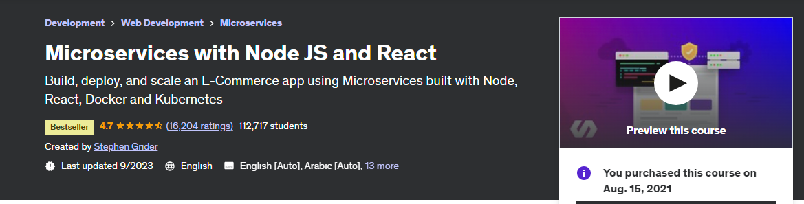

# Microservices with Node JS and React

### Build, deploy, and scale an E-Commerce app using Microservices built with Node, React, Docker and Kubernetes
Course: (https://www.udemy.com/course/microservices-with-node-js-and-react/)  
Course length: <b>54.5 hours</b> 
Course Instructor: Stephen Grinder
   

### Life cycle of Course Outline:
| Section | Topics | Completed |
| ---: | --- | :---: |
| Section 01 | Fundamental Ideas Around Microservices | &check; |
| Section 02 | Mini-microservice App | &check; |  
| Section 03 | Runnning services with Docker | &check; |  
| Section 04 | Orchestrating collections of services with Kubernetes | &check; |  
| Section 05 | Architecture of multi-service Apps | &check; |  
| Section 06 | Leveraging a Cloud Environment for Development | &check; |  
| Section 07 | Response Normalization Strategies | &check; |  
| Section 08 | Database Management | &check; |  
| Section 09 | Authentication Strategies and Options | &check; |  
| Section 10 | Testing Isolated Microservices | &check; |  
| Section 11 | Integrating Server-side Rendered React App | &check; |  
| Section 12 | Code Sharing and Publish NPM | &check; |  
| Section 13 | Create-Read-Update-Destroy Server Setup | &check; |  
| Section 14 | NATS Streaming service - EventBus | &check; |  
| Section 15 | Connecting NATS to NodeJS | &check; |  
| Section 16 | Managing NATS Client | &check; |  
| Section 17 | Cross-service Data Replication in action | &check; |  
| Section 18 | Understanding Event Flow |  |  
| Section 19 | Listening for Events and Handiling Concurrency Issue |  |  
| Section 20 | Worker Services |  |  
| Section 21 | Handling Payments |  |  
| Section 22 | Back to Client |  |  
| Section 23 | CI/CD |  |  

